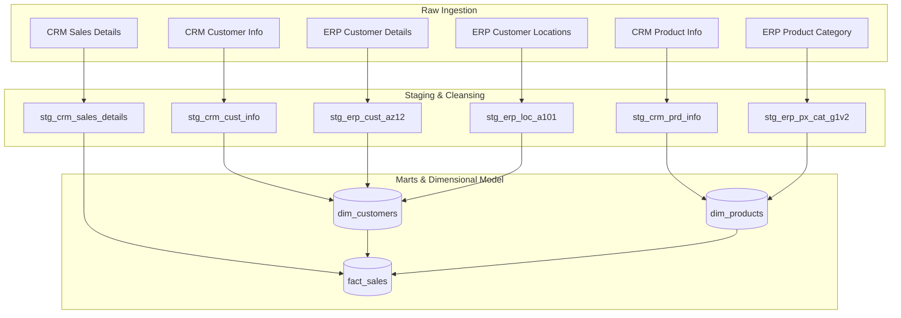
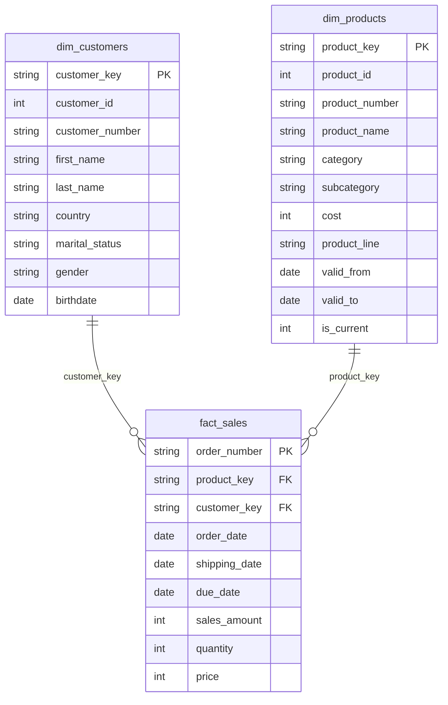

# Modern SQL Data Warehouse & DataOps Project 🚀

Welcome to the **Data Warehouse & DataOps** project repository! This repository demonstrates an enterprise-grade, modern Medallion data warehousing solution built using dbt, SQL Server (or a local PostgreSQL container), and continuous integration (CI) workflows. 

Designed to scale to 2026 industry standards, the project shifts database management from procedural stored procedures to a declarative, dry, and testable analytics engineering pipeline.

---

## 🏗️ Architecture Overview

The pipeline leverages a three-layer **Medallion Architecture**:
1. **Bronze Layer (Raw Source Data):** Direct raw data loaded from CSV files (CRM and ERP source systems).
2. **Silver Layer (Staging & Cleansing):** Cleanses, standardizes casing, normalizes codes, handles date conversions, and deduplicates records. Materialized as dbt views.
3. **Gold Layer (Analytics Marts):** Re-models clean data into a Star Schema (fact and dimensions) with physical materializations and temporal (SCD Type 2) joins.



---

## 📊 Gold Layer ER Diagram (Star Schema)

The analytical data is structured into a optimized star schema:



---

## 🛠️ Project Structure

The project has been refactored to align with standard analytics engineering structures:

```text
├── .github/
│   └── workflows/
│       └── ci.yml           # Automated CI tests pipeline
├── .sqlfluff                # Formatter & linter configuration
├── README.md                # Documentation
├── docker-compose.yml       # Local PostgreSQL sandbox configuration
├── dbt_project.yml          # dbt project configurations
├── profiles.yml             # dbt adapter database configuration
├── models/
│   ├── staging/             # Raw ingestion cleansing models
│   │   ├── src_sources.yml
│   │   ├── stg_crm_cust_info.sql
│   │   ├── stg_crm_prd_info.sql
│   │   ├── stg_crm_sales_details.sql
│   │   ├── stg_erp_cust_az12.sql
│   │   ├── stg_erp_loc_a101.sql
│   │   ├── stg_erp_px_cat_g1v2.sql
│   │   └── schema.yml       # Declarative staging tests
│   └── marts/               # Final Star Schema (fact & dimension tables)
│       ├── dim_customers.sql
│       ├── dim_products.sql
│       ├── fact_sales.sql
│       └── marts.yml        # Declarative marts tests & constraints
└── macros/
    └── clean_gender.sql     # Reusable cleaning logic
```

---

## 🚀 Quickstart & Setup

### Prerequisites
- [Docker & Docker Compose](https://www.docker.com/)
- [Python 3.10+](https://www.python.org/)

### 1. Spin up Local Database Sandbox
Launch the isolated database container running PostgreSQL:
```bash
docker-compose up -d
```

### 2. Install dbt and Dependencies
Create a virtual environment and install dbt packages:
```bash
python -m venv venv
source venv/Scripts/activate # On Windows: venv\Scripts\activate
pip install dbt-postgres sqlfluff-templater-dbt
```

### 3. Run Pipeline and Data Quality Tests
Compile the configurations, execute the incremental pipeline, and trigger assertions:
```bash
dbt deps     # Fetch packages
dbt run      # Materialize staging views & physical gold tables
dbt test     # Run unique, null, and relationship validations
```

### 4. Code Standards & Linting
Validate SQL style constraints against `.sqlfluff` configs:
```bash
sqlfluff lint models/
```
