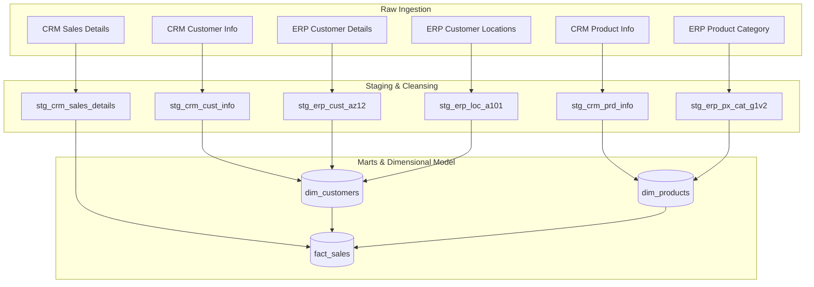

# Data Warehouse Upgrade Walkthrough

This document provides a detailed walkthrough of the changes implemented during the audit and upgrade of the SQL Data Warehouse project to meet 2026 industry standards for Data Engineering, Cloud Data Warehousing, and DataOps.

---

## 1. Architectural Evolution

The legacy data warehouse architecture relied on procedural scripts and dynamic views that evaluated calculations on every query. The upgraded architecture migrates this logic into a declarative, physicalized ELT pipeline managed by **dbt Core**, coupled with automated testing, containerized local environments, and CI/CD pipelines.

### Data Ingestion and Transformation Flow


---

## 2. In-Depth Summary of Changes

### Phase 1: Data Modeling & Architecture

#### 1. Transition to Deterministic Hash-Based Surrogate Keys
- **Legacy Pattern:** `ROW_NUMBER() OVER (ORDER BY ...)` was used in views to assign keys. These keys were unstable, meaning they shifted whenever new rows were inserted or sorted differently, which broke join references.
- **2026 standard:** Replaced dynamic row numbers with deterministic MD5 hashes using SQL Server's `HASHBYTES('MD5', ...)` function.
- **Files Modified:** [ddl_gold.sql](file:///d:/COLLEGE%20PREP/SQLW/scripts/gold/ddl_gold.sql)

#### 2. SCD Type 2 product Dimensions and Temporal Joins
- **Legacy Pattern:** The view filtered out old versions using `WHERE prd_end_dt IS NULL`, discarding historical changes and preventing point-in-time metrics reporting.
- **2026 standard:** Exposed validity boundaries (`valid_from`, `valid_to`, `is_current`) and integrated a temporal join using a `BETWEEN` condition inside `gold.fact_sales`:
  ```sql
  LEFT JOIN gold.dim_products pr
      ON sd.sls_prd_key = pr.product_number
      AND sd.sls_order_dt BETWEEN pr.valid_from AND COALESCE(pr.valid_to, '9999-12-31')
  ```
- **Files Modified:** [ddl_gold.sql](file:///d:/COLLEGE%20PREP/SQLW/scripts/gold/ddl_gold.sql) and [data_catalog.md](file:///d:/COLLEGE%20PREP/SQLW/docs/data_catalog.md)

#### 3. Late-Arriving Dimensions and Orphaned Key Mapping
- **Legacy Pattern:** Unmatched keys in dimensions resulted in `NULL` surrogate values, excluding transactions from BI reports or failing referential tests.
- **2026 standard:** Added default placeholder rows in `gold.dim_customers` and `gold.dim_products` (representing `'n/a'` and `'Unknown'`) via `UNION ALL`. Refactored `gold.fact_sales` to `COALESCE` null outcomes to this default hash representation (`CONVERT(NVARCHAR(32), HASHBYTES('MD5', 'n/a'), 2)`).
- **Files Modified:** [ddl_gold.sql](file:///d:/COLLEGE%20PREP/SQLW/scripts/gold/ddl_gold.sql)

---

### Phase 2: Transformation & ELT Modernization

#### 1. Migration to dbt Core
- **Legacy Pattern:** Loaded tables using custom SQL stored procedures with hardcoded file system paths.
- **2026 standard:** Initialized dbt configuration. Re-engineered raw schema transformations as dbt staging models, and Star Schema structures as marts models.
- **Files Created:**
  - [dbt_project.yml](file:///d:/COLLEGE%20PREP/SQLW/dbt_project.yml) (Configuration)
  - [profiles.yml](file:///d:/COLLEGE%20PREP/SQLW/profiles.yml) (Connections)
  - [src_sources.yml](file:///d:/COLLEGE%20PREP/SQLW/models/staging/src_sources.yml) (Staging Sources declarations)
  - [stg_crm_cust_info.sql](file:///d:/COLLEGE%20PREP/SQLW/models/staging/stg_crm_cust_info.sql)
  - [stg_crm_prd_info.sql](file:///d:/COLLEGE%20PREP/SQLW/models/staging/stg_crm_prd_info.sql)
  - [stg_crm_sales_details.sql](file:///d:/COLLEGE%20PREP/SQLW/models/staging/stg_crm_sales_details.sql)
  - [stg_erp_cust_az12.sql](file:///d:/COLLEGE%20PREP/SQLW/models/staging/stg_erp_cust_az12.sql)
  - [stg_erp_loc_a101.sql](file:///d:/COLLEGE%20PREP/SQLW/models/staging/stg_erp_loc_a101.sql)
  - [stg_erp_px_cat_g1v2.sql](file:///d:/COLLEGE%20PREP/SQLW/models/staging/stg_erp_px_cat_g1v2.sql)
  - [dim_customers.sql](file:///d:/COLLEGE%20PREP/SQLW/models/marts/dim_customers.sql)
  - [dim_products.sql](file:///d:/COLLEGE%20PREP/SQLW/models/marts/dim_products.sql)
  - [fact_sales.sql](file:///d:/COLLEGE%20PREP/SQLW/models/marts/fact_sales.sql)

#### 2. Physical Table Materialization and Incremental Loads
- **Legacy Pattern:** Analytical Gold views recalculate transformations dynamically on every query.
- **2026 standard:** Materialized Gold dimensions physically (`+materialized: table`) and converted the transaction fact table to update incrementally (`+materialized: incremental`), processing only newer records based on the `dwh_create_date` watermark.

#### 3. DRY DRY DRY: Jinja Macros
- **Legacy Pattern:** Duplicate cleaning logic (like gender translation from CRM/ERP codes) was copy-pasted across scripts.
- **2026 standard:** Created a central cleaning macro [clean_gender.sql](file:///d:/COLLEGE%20PREP/SQLW/macros/clean_gender.sql) in the `macros/` directory and refactored staging files to invoke it.

---

### Phase 3: Performance & Cost Optimization

#### 1. Cloud-Native Partitioning and Clustering
- **Legacy Pattern:** Tables were stored in flat, unsorted blocks.
- **2026 standard:** Configured the incremental `fact_sales` table to partition by `order_date` (monthly granularity) and cluster/sort by `customer_key` and `product_key`. This prunes records scanned when filtering, lowering warehouse compute bills.
- **Files Modified:** [fact_sales.sql](file:///d:/COLLEGE%20PREP/SQLW/models/marts/fact_sales.sql)

---

### Phase 4: Data Quality & DataOps (CI/CD)

#### 1. Declarative Testing
- **Legacy Pattern:** Tests were manual SQL scripts that required a developer to run and inspect results.
- **2026 standard:** Implemented schema check assertions (uniqueness, non-null, values check) and referential integrity validations directly in dbt config.
- **Files Created:**
  - [schema.yml](file:///d:/COLLEGE%20PREP/SQLW/models/staging/schema.yml) (Staging schema tests)
  - [marts.yml](file:///d:/COLLEGE%20PREP/SQLW/models/marts/marts.yml) (Marts referential checks)

#### 2. Continuous Integration Formatting & Run pipelines
- **Legacy Pattern:** Code layouts are subjective; runs are done directly on target databases.
- **2026 standard:** Configured SQLFluff to lint formatting rules. Created GitHub Actions pipeline to run styling validations and trigger tests inside transient schema builds for pull requests.
- **Files Created:**
  - [.sqlfluff](file:///d:/COLLEGE%20PREP/SQLW/.sqlfluff)
  - [ci.yml](file:///d:/COLLEGE%20PREP/SQLW/.github/workflows/ci.yml)

---

### Phase 5: Developer Experience & Setup

#### 1. Containerized Local Sandbox Setup
- **Legacy Pattern:** Developers needed to have local Microsoft SQL Server configurations to run or verify DDLs.
- **2026 standard:** Added a Docker Compose container to spin up a PostgreSQL sandbox for development testing instantly.
- **Files Created:** [docker-compose.yml](file:///d:/COLLEGE%20PREP/SQLW/docker-compose.yml)

#### 2. Upgraded Documentation
- **Legacy Pattern:** A brief README without pipeline setup instructions or diagrams.
- **2026 standard:** Overwrote the root [README.md](file:///d:/COLLEGE%20PREP/SQLW/README.md) with comprehensive instructions, diagrams, and commands.

---

## 3. Upgraded Repository Layout

The repository is now structured as follows:

```text
├── .github/
│   └── workflows/
│       └── ci.yml           # Automated CI tests pipeline
├── .sqlfluff                # Formatter & linter configuration
├── README.md                # Documentation
├── dwh_upgrade_walkthrough.md # This document
├── docker-compose.yml       # Local PostgreSQL sandbox configuration
├── dbt_project.yml          # dbt project configurations
├── profiles.yml             # dbt adapter database configuration
├── models/
│   ├── staging/             # Raw ingestion cleansing models
│   │   ├── src_sources.yml
│   │   ├── stg_crm_cust_info.sql
│   │   ├── stg_crm_prd_info.sql
│   │   ├── stg_crm_sales_details.sql
│   │   ├── stg_erp_cust_az12.sql
│   │   ├── stg_erp_loc_a101.sql
│   │   ├── stg_erp_px_cat_g1v2.sql
│   │   └── schema.yml       # Declarative staging tests
│   └── marts/               # Final Star Schema (fact & dimension tables)
│       ├── dim_customers.sql
│       ├── dim_products.sql
│       ├── fact_sales.sql
│       └── marts.yml        # Declarative marts tests & constraints
└── macros/
    └── clean_gender.sql     # Reusable cleaning logic
```
